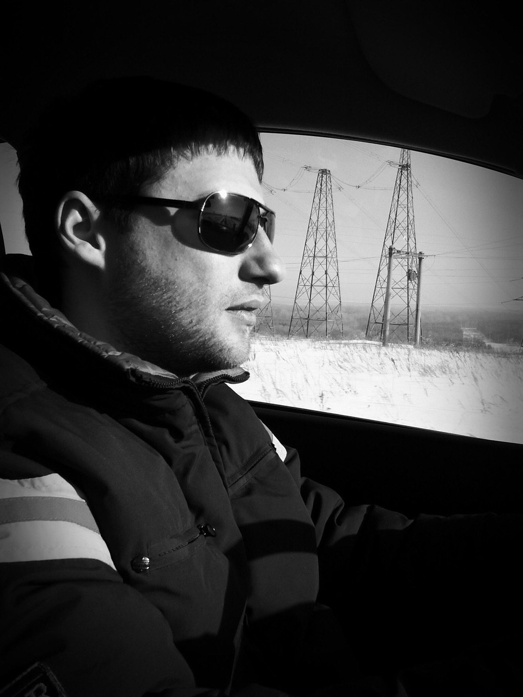

# Урицкий Сергей Андреевич

*Урицкий С.А.* — родился в г. Уфа. Закончил Уфимский Государственный Авиационный Технический Университет по специальности литейное производство. На данный момент прохожу дистанционное обучение на тему «Мобильная разработка для начинающих».

Навыки:
* Владение компьютером;
* Знание английского на начальном уровне;
* Работа на удаленке.

